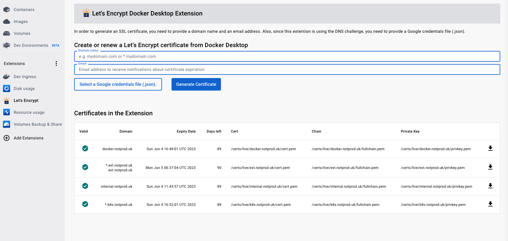

# Let's Encrypt

Docker extension to get and renew Let's Encrypt SSL certificates

The extension only works with Google DNS for now, I'm adding Cloudflare support in the next days. The generated certificates are stored inside of a Volume. Make sure you export your certs to a safe location. You can use the `Volumes Backup & Share` extension for that purpouse.

Also, bear in mind that volumes that belong to the extension are deleted when the extension is uninstalled.

I'll be adding a way of exporting the certificates, the download icon is there, I just need to add the function that exports the files.

The extension will list all the certificates generated and stored in the volume displaying the domains that the certs are valid for, the expiry date and how many days until renewal.

## Google DNS Challenge

In order to generate a certificate, you need the Google Cloud Platform credentials JSON file (How to create a Service Account https://developers.google.com/identity/protocols/OAuth2ServiceAccount#creatinganaccount)

The process needs 2 parameters, the credentials file and the name of the domain (you have to own the domain and it has to be configured in Google Cloud).

## Roadmap

- [ ] Implementing the download button
- [ ] Adding support for Cloudflare
- [ ] Implementing certificate renewal
- [ ] Add certficate to Kubernetes
- [ ] Add certificate to Docker
- [ ] Create proxy container with certificates for Docker Compose
